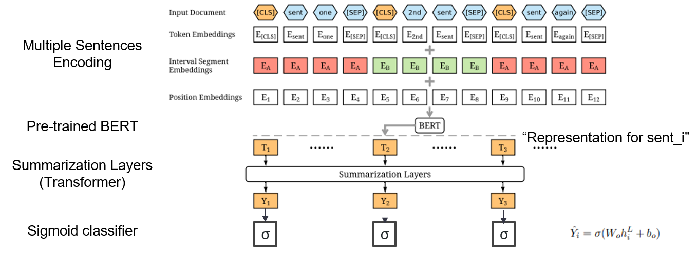

# KoBertSum


## 모델 소개

### KoBertSum이란?

KoBERTSUM은 ext 및 abs summarizatoin 분야에서 우수한 성능을 보여주고 있는 [BertSum모델](https://github.com/nlpyang/PreSumm)을 한국어 데이터에 적용할 수 있도록 수정한 한국어 요약 모델입니다.

해당 코드는 BertSum 모델을 한국어로 개선한 KoBertSum 코드를 변경하여 사용하기 수월하게 만들고 있습니다.

##### 개선사항
- huggingface models에서 모델을 불러오거나, 로컬에 저장된 모델을 실행 시 인자로 주어 다양한 모델의 적용 및 실험 가용성을 향상시킬 예정입니다.
- 코드 내 커맨드 실행 부분으로 인해 코드 흐름에 방해가 되거나, 파악되지 않는 부분들을 개선할 예정입니다.(os.system()등의 사용으로 인해 디버깅의 어려움)
- 적용되고 있는 huggingface transformers버전이 4미만일 경우 적용되지 않는 부분들을 개선할 예정입니다.

- KoBertSum 원코드: https://github.com/uoneway/KoBertSum

현재는

- 이용 Data로 한국어 문서 추출요약 AI 경진대회(~ 2020.12.09)에서 사용된 [Bflysoft-뉴스기사 데이터셋](https://dacon.io/competitions/official/235671/data/)에 맞춰져 있습니다.

- `BertSumExt`모델만 지원합니다.


### BertSum이란?

BertSum은 BERT 위에 inter-sentence Transformer 2-layers 를 얹은 구조를 갖습니다. 이를 fine-tuning하여 extract summarization을 수행하는 `BertSumExt`, abstract summarization task를 수행하는 `BertSumAbs` 및 `BertSumExtAbs` 요약모델을 포함하고 있습니다.

- 논문:  [Text Summarization with Pretrained Encoders](https://arxiv.org/abs/1908.08345) (EMNLP 2019 paper)
- 원코드: https://github.com/nlpyang/PreSumm

기 Pre-trained BERT를 summarization task 수행을 위한 embedding layer로 활용하기 위해서는 여러 sentence를 하나의 인풋으로 넣어주고, 각 sentence에 대한 정보를 출력할 수 있도록 입력을 수정해줘야 합니다. 이를 위해

- Input document에서 매 문장의 앞에 [CLS] 토큰을 삽입하고
    ( [CLS] 토큰에 대응하는 BERT 결과값(T[CLS])을 각 문장별 representation으로 간주)

- 매 sentence마다 다른 segment embeddings 토큰을 더해주는 interval segment embeddings을 추가합니다.

  

## Install

1. 필요 라이브러리 설치

    ```
    python main.py -task install
    ```

## Usage

1. 데이터 Preprocessing

   데이터를 `ext/data/raw` 에 넣어준 후 다음을 실행하여 BERT 입력을 위한 형태로 변환합니다.

   - `n_cpus`: 연산에 이용할 CPU 수

    ```
    python preprocess_data.py -model_path monologg/kobert -n_cpus 2 -data_path ../ext/data -save_path ../data
    ```
   
   결과는 `ext/data/bert_data/train_abs` 및  `ext/data/bert_data/valid_abs` 에 저장됩니다.
   
2. Fine-tuning

    KoBERT 모델을 기반으로 fine-tuning을 진행하고, 1,000 step마다  Fine-tuned model 파일(`.pt`)을 저장합니다. 

    - `target_summary_sent`: `abs` 또는 `ext` . 
    - `visible_gpus`: 연산에 이용할 gpu index를 입력. 
      예) (GPU 3개를 이용할 경우): `0,1,2`

    ```
    python train_function.py \
	-mode train \
	-model_path monologg/kobert \
	-data_path ../data/train \
	-save_checkpoint_steps 1000 \
	-visible_gpus 0 \
	-report_every 50 \
	-ext_dropout 0.1 \
	-max_pos 512 \
	-lr 2e-3 \
	-warmup_steps 10000 \
	-batch_size 3000 \
	-accum_count 2 \
	-train_steps 50000 \
	-use_interval true
    ```

    결과는  `models` 폴더 내 finetuning이 실행된 시간을 폴더명으로 가진 폴더에 저장됩니다. 

3. Validation

   Fine-tuned model마다 validation data set을 통해 inference를 시행하고, loss 값을 확인합니다.

   - `model_path`:  model 파일(`.pt`)이 저장된 폴더 경로

   ```
   python main.py -task valid -model_path 1209_1236
   ```

   결과는 `ext/logs` 폴더 내 `valid_1209_1236.log` 형태로 저장됩니다.

4. Inference & make submission file

    Validation을 통해 확인한 가장 성능이 우수한 model파일을 통해 실제로 텍스트 요약 과업을 수행합니다.

    - `test_from`:  model 파일(`.pt`) 경로
    - `visible_gpus`: 연산에 이용할 gpu index를 입력. 
      예) (GPU 3개를 이용할 경우): `0,1,2`

    ```
    python main.py -task test -test_from 1209_1236/model_step_7000.pt -visible_gpus 0
    ```

    결과는 `ext/data/results/` 폴더에 `result_1209_1236_step_7000.candidate`  및 `submission_날짜_시간.csv` 형태로 저장됩니다.
